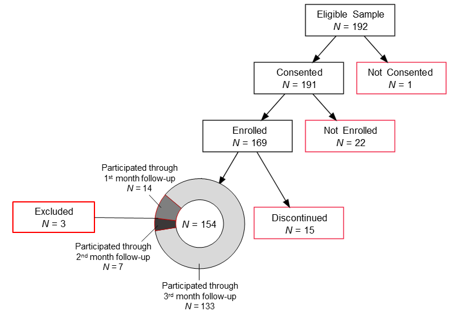

```{r, packages_workflow, message=FALSE, warning=FALSE}
# Packages for lab workflow 
library(conflicted) # detect and warn about function conflicts
conflict_prefer("filter", "dplyr")
conflict_prefer("select", "dplyr")

library(here)  # establish project directory consistently as working directory
```


```{r, paths}
# Absolute paths
switch (Sys.info()[['sysname']],
        # PC paths
        Windows = {
          path_study_start <- "P:/studydata/risk/data_processed/meta"
          path_results <- "P:/studydata/risk/chtc/meta/jobs/training/model_selection/output/results"},

        # IOS paths
        Darwin = {
          path_study_start <- "/Volumes/private/studydata/risk/data_processed/meta"
          path_results <- "/Volumes/private/studydata/risk/chtc/meta/jobs/training/model_selection/output/results"}
        )
```


```{r}
# Relative paths
path_models <- "meta/ana_scripts/model_output"
path_meta <- "P:/studydata/risk/data_processed/meta"
path_shared <- "P:/studydata/risk/data_processed/shared"
```

```{r setup, include = FALSE}
#Packages & Source
library("papaja")
library(tidyverse)
library(tidymodels)
library(vroom)
library(kableExtra)
library(lubridate)
library(ggplot2)
library(ggforce)
theme_set(theme_classic())
options(knitr.kable.NA = '')

source(here("meta/fun_meta.R"))
source(here("../lab_support/chtc/fun_chtc.R"))
source(here("../lab_support/print_kbl.R"))
```


<!--Vocabulary.  Lets keep adding to this!
grouped 10-fold cross validation(grouped 10-fold CV for short);  grouped 10-fold cross validation with 10 repeats (grouped 10x10-fold CV for short)

training sets, validation sets (this is what you use for performance), test set (you don't have one but you mention it so use this term).
At some point you talk about "fits" but you really are talking about balanced accuracy across 100 "validation sets"

model configuration  (you talk about best models but it really should be best model configuration).
You fit (or train; choose one term) model configurations in training sets to get models that can be used for prediction

model selection (which is technically selecting the "best" model configuration); model evaluation (which is technically evaluating the expected performance of the 
best model configuration)
-->

## Alcohol Use Disorder
According to the National Survey on Drug Use and Health 14.1 million adults in the US met the criteria for alcohol use disorder in 2019 [@substanceabuseandmentalhealthservicesadministrationsamhsa2019NationalSurvey2019]. This is roughly 6% of the US adult population. When left untreated, alcohol use disorder can result in physical, mental, financial, and social consequences [@rehmRisksAssociatedAlcohol2011]. Unfortunately, many people do not receive treatment, and those who do typically only receive treatment for a short period of time and at times they are in acute distress (i.e., detoxification in a hospital setting, court-mandated treatment). 

Yet, alcohol use disorder is a chronic relapsing disease [@rounsavilleLapseRelapseChasing2010; @scottPathwaysRelapsetreatmentrecoveryCycle2005]. People can relapse days, weeks, months, or even years after achieving abstinence [@witkiewitzLapsesFollowingAlcohol2008; @jinPredictorsRelapseLongterm1998; @anderssonRelapseInpatientSubstance2018; @millerHowEffectiveAlcoholism2001]. Lapses, an initial setback or slip, are often an early warning sign of relapse, a full return to previous drinking behavior [@witkiewitzRelapsePreventionAlcohol2004]. Studies show that lapses predict future lapses, with more frequent lapses resulting in increased chances of relapse [@rounsavilleLapseRelapseChasing2010]. Likewise, longer durations of abstinence is associated with decreased chances of lapse, suggesting the stability of a patient’s recovery itself as an important predictor of abstinence [@rounsavilleLapseRelapseChasing2010]. In fact, the most important predictor of relapse is whether the individual has already had a lapse during treatment [@hogstrombrandtPredictionSingleEpisodes1999]. This high correlation between an initial lapse and relapse is the abstinence violation effect, which states that people who internalize feelings of loss of control, guilt, and hopelessness after violating a self-imposed rule (i.e., abstinence) have a greater risk of relapse compared to those who view the lapse as external and controllable [@marlattRelapsePreventionAlcohol; @hogstrombrandtPredictionSingleEpisodes1999]. Thus, identifying when an initial lapse will occur is an important goal in preventing lapses, repeated lapses, and relapse. 

Like most mental health disorders, alcohol use disorder can be characterized by fluctuations in affective and behavioral states that covary with the severity of the underlying disorder and impact its treatment. The ability to detect these changes offers the opportunity to selectively deliver different interventions to patients that match their needs in that moment.  For example, during periods of stability, patients in recovery from alcohol use disorder might benefit from interventions that help them modify their social network and daily activities to include more time with family and friends who support their recovery. In contrast, during times of peak stress and associated alcohol craving, they might need focused interventions that prevent an imminent lapse back to alcohol use. 

## Lapse Risk Factors
Lapses may seem to come out of nowhere, but they are often preceded by changes in cognitive (e.g., negative affect, craving), situational (e.g., lack of social support, risky situations), and behavioral (e.g., decreased social interactions, coping strategies) factors [@rounsavilleLapseRelapseChasing2010; @jinPredictorsRelapseLongterm1998; @anderssonRelapseInpatientSubstance2018]. 

These risk factors are known as proximal risk factors that are fluid and change over time (much like how mental health disorder symptoms can ebb and flow through periods of stability and periods of lapse) [@rounsavilleLapseRelapseChasing2010; @witkiewitzLapsesFollowingAlcohol2008]. Proximal risk factors contrast distal risk factors - stable states or traits that contribute to a mental health disorder, but do not change much over time. For example, one’s genetic makeup, the presence of co-occurring psychopathology, or alcohol use disorder severity may contribute to whether one is predisposed to alcohol use disorder, but they are less involved in the cyclical nature of lapses [@huffordRelapseNonlinearDynamic2003]. On the other hand, fluctuations in proximal factors often precipitate a lapse [@witkiewitzRelapsePreventionAlcohol2004; @chihPredictiveModelingAddiction2014; @larimerRelapsePrevention1999]. But due to the dynamic nature of these factors, traditional treatments (e.g., monthly therapy or counseling sessions) may not be best suited for monitoring for changes in lapse risk. 

Not all proximal risk factors are detectable within the same time window. Situational factors, such as passing a bar or being around people who are drinking may immediately precede a lapse. Other stressors, such as getting upsetting news from a family member or increased financial strain, may slowly increase lapse risk over hours, days or weeks. Thus, a system for continuously monitoring a person's lapse risk is critical in detecting when someone will lapse. 

## Personal Sensing
With new advances in technology, we can now accomplish this through personal sensing. Personal sensing is a longitudinal in situ measurement approach for collecting data via smartphone sensors, logs, and social media apps [@mohrPersonalSensingUnderstanding2017]. Current digital therapeutics, platforms designed to deliver evidenced-based treatments and interventions, do not yet integrate these data [@digitaltherapeuticsallianceDigitalTherapeuticsDefinition2019]. Yet there is much potential for these therapeutics to harness personal sensing data to capture fluctuations in risk in real time.

The first step to improving digital therapeutics with personal sensing is to be able to build accurate and effective predictive algorithms. Research in the area of mental health broadly has begun to use personal sensing data to predict constructs such as social anxiety [@jacobsonDigitalBiomarkersSocial2020], depression [@wangExaminingCorrelationDepression2021; @razaviDepressionScreeningUsing2020; @baiTrackingMonitoringMood2021; @reeceInstagramPhotosReveal2017; @dechoudhuryPredictingPostpartumChanges2013], bipolar disorder [@palmiusDetectingBipolarDepression2016; @faurholt-jepsenSmartphonebasedObjectiveMonitoring2018] and schizophrenia [@mitchellQuantifyingLanguageSchizophrenia2015; @barnettRelapsePredictionSchizophrenia2018; @mcmanusMiningTwitterData2015].

In the area of substance use the focus has been on predicting drinking or substance use episodes. Some studies have been able to use smartphone-sensors to predict current drinking episodes [@baeDetectingDrinkingEpisodes2017; @baeMobilePhoneSensors2018]. However, this is too late to deliver preventative interventions. Two recent studies have been able to predict future drug craving with geolocation data [@epsteinPredictionStressDrug2020] and future smoking lapses with EMA data [@hebertPredictingFirstSmoking2021]. These predictive algorithms, however, are not yet meeting the threshold for clinical implementation. 

It is also important to note that geolocation and EMA place differing amounts of burden on the individual providing the data. Active methods, like EMA, require frequent (i.e., at least daily) interactions with the personal sensing platform and as such place more effort on the individual using the platform. Passive methods, like geolocation, require minimal interactions (i.e., installing an app and setting permissions once) with the personal sensing platform and operate passively in the background.

Additionally, different personal sensing data could have different utility in personal sensing-assisted digital therapeutics. For example, geolocation may be useful for identifying features predictive of an immediate lapse (i.e., being in or near a bar) and could be used to deploy harm-reduction strategies. On the other hand, EMA could be used to identify features more predictive of a slow gradual risk of lapse (i.e., how they slept last night, how much pain they are in, and whether they expect to face any upcoming stressors this week) and recommend connecting with a therapist.  


## Cellular Communication Logs
One understudied personal sensing method in the lapse risk literature is cellular communication logs. Cellular communication logs are both passive and they have the potential to capture risk factors on varying timetables. We may be able to capture immediate risk based on who someone is calling or what time of day it is. Additionally, slower acting risk indicators may also be detected. Decreased interactions may signify isolation common with depressive symptoms, reaching out to people in one’s social network could signify a positive coping strategy, or changes in patterns between a single person in one’s social network could indicate conflict [@millerHowEffectiveAlcoholism2001; @huffordRelapseNonlinearDynamic2003; @chihPredictiveModelingAddiction2014].

Not only does it have potential predictive power, but it also appears to be a feasible source of personal sensing data. In a smartphone-based sensing platform the primary expense on the individual is the smartphone. Smartphone usage is already widespread. Eighty-five percent of US adults have a smartphone and this number is consistent across all sociodemographic groups, including those in recovery programs for substance use [@pewresearchcenterMobileFactSheet2021; @massonHealthrelatedInternetUse2019].  Additionally, people generally find personal sensing of cellular communication logs to be acceptable [@wyantAcceptabilityPersonalSensinginprep]. That is people are no less likely to provide cellular communication logs than other personal sensing data streams (i.e., EMA, Geolocation, Sleep). 

## Social Context
Many proximal lapse predictors are inherently social [@hunter-reelEmphasizingInterpersonalFactors2009]. For example, decreased interactions may signify isolation common with depressive symptoms, reaching out to people in one’s social network could signify a positive coping strategy, or changes in patterns between a single person in one’s social network could indicate conflict. Accordingly, these factors are intrinsically linked to social interactions [@hunter-reelEmphasizingInterpersonalFactors2009; @witkiewitzEmphasisInterpersonalFactors2005; @stantonRelapsePreventionNeeds2005].

On its own, the nature of people’s social interactions with others appears to be a salient factor relevant to lapse risk. Positive social interaction has been associated with positive alcohol treatment outcomes [@grohFriendsFamilyAlcohol2010; @kellyRoleAlcoholicsAnonymous2012; @zywiakDecomposingRelationshipsPretreatment2002; @longabaughNetworkSupportPrognostic2010]. It is thought that the social component of self-help groups like Alcoholics Anonymous (i.e., increasing pro-abstinence relationship ties) play a major contributing role in their efficacy [@kellyRoleAlcoholicsAnonymous2012; @grohSocialNetworkVariables2008; @woffServiceProvidersPerceptions1996; @humphreysEnhancedFriendshipNetworks1999]. The buffering hypothesis of social support suggests that social relationships may buffer individuals against the negative effects of stress by providing a source of resources to promote adaptive responses to stress [@cohenStressSocialSupport; @holt-lunstadSocialRelationshipsMortality2010]. With stress being an often-cited precipitant of alcohol lapse, it is likely these buffering effects extrapolate to lapse risk [@fronkStressAllostasisSubstance2020]. 

There is also much literature on the importance of social network influences on drinking behavior [@hunter-reelEmphasizingInterpersonalFactors2009; @alvarezSocialNetworkHeavy2021]. A social network made up of heavy drinkers or abstainers can ultimately influence one’s recovery towards maintaining abstinence or lapsing [@alvarezSocialNetworkHeavy2021; @gordonSocialNetworksRecovery1991; @mohrGettingGettingHigh2001]. Individuals in recovery who maintain interactions with people who do not support their recovery is associated with decreased likelihood of maintaining abstinence. Social interactions with negative peer influences (e.g., heavy drinkers) may have more of an effect on treatment outcome than positive peer influences (e.g., abstainers) [@alvarezSocialNetworkHeavy2021]. This relationship between social support and lapses is robust and extends to substances other than alcohol [@havassySocialSupportRelapse1991]. 

Since many social interactions occur or are planned over the phone, cellular communication logs offer insight into patterns of social interaction. We know that social relationships are dynamic [@hidalgoDynamicsMobilePhone2008; @sekaraFundamentalStructuresDynamic2016; @saramakiSecondsMonthsOverview2015; @kossinetsEmpiricalAnalysisEvolving2006]. So, with time-stamped logs there is potential to build a sensing system that tracks how these interactions fluctuate over time. For example, changes in their top contacts (i.e., who they are interacting with the most) or changes in patterns of activities (e.g., is an individual is consistently ignoring phone calls from a contact they normally interact often with?). 

However, these communications may become much more powerful when they are contextualized (e.g., pleasantness of interactions with the contact, whether the contact is supportive of their recovery, drinking history with contact).  For example, context in concert with communication logs can tell us that someone is reaching out to other people in recovery or that their top contacts have recently shifted to include only people supportive of their recovery. So, we can imagine that providing this context to cellular communication logs could greatly increase the predictive signal. Take one more example - an outgoing phone call late at night might be related to lapse risk, but the direction will be very different if they are calling their sponsor vs. a former drinking buddy.

## Present Study
The present study seeks to build a personal sensing algorithm to predict next hour lapse probability from contextualized cellular communication logs. Identifying when someone will lapse with hour-by-hour temporal precision is a critical first step in improving digital therapeutics. If we can detect when someone is most likely to lapse we can deliver interventions directly to the individual instead of expecting them to engage with the therapeutic on their own.

Since people with alcohol use disorder may require long-term monitoring, it is important that a digital therapeutic does not place too much burden on the individual. As such we will evaluate whether any incremental benefit exists from the more active context (e.g., pleasantness of interactions with the contact, whether the contact is supportive of their recovery, drinking history with contact) when compared to a passive only configuration.

This study will extend our current understanding of distal risk factors by identifying additional proximal risk factors over varying time windows. We will evaluate the importance of specific features within our predictive algorithm. Identifying the top performing features will set the foundation for future studies to begin to not only predict *when* someone will lapse but also *which* treatment should be delivered.


# Method
This project performs the initial analyses on a subset of data collected from 2017 – 2019 as part of a larger grant funded through the National Institute of Alcohol Abuse and Alcoholism (R01 AA024391). A full list of measures used in the parent project can be found at [<https://osf.io/brs68/>].

## Research Transparency
We value the principles of research transparency that are essential to the robustness and reproducibility of science [@schonbrodtVoluntaryCommitmentResearch2015]. Consequently, we maximized transparency by reporting all data exclusions, manipulations, and available measures in the study [@simmons21WordSolution2012]. We also made the data, analysis scripts and annotated results, self-report surveys, and other study materials associated with this study publicly available [<https://osf.io/brs68/>].

## Participants
We recruited a community sample of people in initial stages of recovery for alcohol use disorder from the Madison area. Avenues of recruitment included referrals from clinics, self-help groups, Facebook, radio, and television. Those who were interested in participating in our three-month study were given a brief description (i.e., told that our research focused on learning how mobile health technology can be used to provide individual support to anyone recovering from alcohol addiction) a short phone screen to determine initial eligibility (i.e., At least 18 years old, ability to read and write in English, and an eligible smartphone with existing cellphone plan).

One hundred ninety-two participants met criteria for enrollment after completing a more detailed in-person screening visit (Figure 1). We excluded potential participants if they did not meet the criteria for moderate or severe alcohol use disorder (as defined by the DSM-5), did not have a goal of long-term abstinence, had not abstained from alcohol for at least one week, already had over two months of abstinence, or had severe symptoms of psychosis or paranoia. One hundred ninety-one participants consented to participate in the study at the screening session and 169 subsequently enrolled in the study at the enrollment visit which occurred approximately one week later. Of the 169 participants enrolled in the study, 154 provided at least one month of communication logs and EMA surveys. This was an additional requirement for the current study because cellphone communications were collected at each one month follow-up. We dropped data from three participants due to concerns about the quality of their data. These exclusions occurred during the cleaning process and prior to any analyses. Our final analyses were on a sample of 151 participants. 



Figure 1. Flowchart of participant retention. The red boxes show all points participants were discontinued or withdrawn. 154 participants completed through the first month follow-up. Of these 154, three participants' data were excluded leaving us with an analysis sample of 151.   


## Procedure
Our study involved five in-person visits (screening, enrollment, and three follow-up visits). It also required completion of daily EMA surveys to document alcohol lapses, and access to non-deleted text message and call logs (i.e., cellular communication logs). All procedures were approved by the University of Wisconsin-Madison Institutional Review Board.

During the screening session we obtained informed consent, determined eligibility, and documented demographic information, history of lifetime drug and alcohol use, and mental health traits. Participants that consented and were deemed eligible came back for a second enrollment visit. During enrollment, participants were briefed on how to delete log entries they did not want to share with us and completed a practice EMA survey. Participants also reported contacts they frequently communicated with and answered a series of questions documenting context information about their interactions with each contact (type of relationship with contact, whether they drank with contact in past, drinking status of contact, whether contact would drink in their presence, whether the contact is in recovery, the level of supportiveness the contact provides, and the pleasantness of their interactions with the contact). Participants returned for three follow-up visits, each one month apart. 

At each follow-up visit, we downloaded participants' cellular communication logs. These communication logs included the phone number of the other party, whether the call or message was incoming or outgoing, the duration of the call, and the date and time of the call or message. Participants also provided context information for newly identified frequent contacts (i.e., at least two communications in the past month). At the third follow-up visit, participants were debriefed and thanked for their participation. 

## Feature Engineering and Model Training
We used various feature engineering methods to maximize model performance. Features were selected over several different windows of data preceding the lapse prediction (6, 12, 24, 48, 72, and 168 hours). For example if we were using a window of 24 hours and wanted to predict probability of a lapse at 6:00 PM then we would use all available features since 6:00 PM the day before up until the hour we were predicting for. We believed it was important to include varying time windows because it is likely that some features, like communicating with an old drinking friend, may be more temporally close to a lapse (i.e., 6 hours) and other features, like a slow increase in number of unanswered incoming calls, may reflect likelihood of a lapse over a longer period of time (i.e, 168 hours).  

To condense several log entries into a single feature we wrote several functions that scaled each feature on two metrics (raw and percent). Raw features included things such as the raw proportion of incoming calls, the raw mean duration of calls, the raw rate of text messages per hour, and the raw count of incoming text messages from supportive contacts. Percent features converted the raw features into a percent difference. To do this we first calculated the baseline (proportion, rate, etc.) over all available features (i.e., not restricted to a specific time window) prior to the date and time of the label we were predicting. We then calculated whether the current raw feature was higher or lower than their baseline using the formula $(raw - baseline)/baseline$. We did not know a priori which type of feature would be best (raw, percent, or raw and percent) so we trained models using all three combinations of features.

Phone number and participant ID were used jointly as the unique identifier to merge the communication logs with the context information. Communication logs were from several OS versions of both Android and iPhone smartphones. The phone numbers had to be carefully cleaned to match the context data. This included standardizing numbers by removing US but not non-US country codes, removing special characters, and deriving missing area codes from a participant's log and context data. I wrote a series of functions that cleaned, extracted, and validated the phone numbers [<https://osf.io/d72c9/>]. US numbers were valid if they had a registered North-American area code and were 10 digits long. Non-US numbers were validated based on country code, length of number, and when applicable area code. Once we were able to match the communication logs to the context data we could derive context features (e.g., number of communications with drinkers) and combination features (e.g., proportion of incoming calls from people who are not in recovery).

When engineering features, we distinguished between active features (features derived from context) and passive features (features derived from communication logs). This distinction was used during model training to specify which feature set we wanted to use. The active feature set used all available features (active and passive) and the passive feature set was restricted to only passive features.  

Since we had an imbalanced outcome variable, we also considered different class resampling methods during model training. We used an up-sampling method where our positive labels (lapses) were bootstrapped until they equaled the number of negative labels (no lapses). We used a down-sampling method where our negative labels were randomly sampled from until they equaled the number of positive labels. We also used the Synthetic Minority Over-Sampling Technique (SMOTE) to produce new synthetic positive labels until they equaled the number of negative labels. These resampling methods were only used on the training data and not applied to the held-out validation sets.  

Our candidate model configurations differed on statistical algorithm (glmnet, random forest, Knn), feature set (active, passive), feature type (percent, raw, percent and raw), class resample (up, down, SMOTE). Each model configuration was also tuned on the hyperparameters associated with each statistical algorithm (i.e., lambda and alpha for glmnet, mtry, min n and trees for random forest, and neighbors for Knn). This resulted in us training over 20,000 unique configurations.


## Data Analysis Plan

We conducted all analyses in R version 4.0.3 [@rcoreteamLanguageEnvironmentStatistical2021] using RStudio [@rstudioteamRStudioIntegratedDevelopment2020a] and the tidyverse and tidymodels ecosystem of packages [@wickhamWelcomeTidyverse2019; @kuhnTidymodelsCollectionPackages2020]. 

We characterized our sample of participants across standard demographics (age, sex, race, ethnicity, income, education level, employment status, and marital status). We also characterized our participants according to life history of drug and alcohol use. This includes alcohol use disorder milestones (age of first drink, age of regular drinking, age of problematic drinking, age of first quit attempt), number of quit attempts, average number of days spent drinking prior to quitting, treatment history for alcohol use disorder (long-term residential, short-term residential, outpatient, individual counseling, group counseling, self-help groups), whether they have received medication for alcohol use disorder, the number of DSM-5 criteria for alcohol use disorder reported, number and types of drugs used over their lifetime, and whether they have ever injected drugs. Finally we characterized various mental health outcomes of our participants using validated measures such as the Symptom Checklist-90 [@derogatisSCL90OutpatientPsychiatric1973], Intolerance of Uncertainty Scale [@freestonWhyPeopleWorry1994], Anxiety Sensitivity Index-3 [@taylorRobustDimensionsAnxiety2007], Distress Tolerance Scale [@simonsDistressToleranceScale2005], McMaster Family Assessment Device [@millerMcMasterFamilyAssessment1985], and the Multidimensional Personality Questionnaire Short Form [@patrickDevelopmentValidationBrief2002. 

We collected lapse start and end times from participants with a four-time daily EMA. Our outcome labels for training our model consisted of lapse or no lapse at the level of the hour. This means each participant had 24 labels per day for up to 90 days. We treated each label as an independent observation. As expected our negative labels (no lapses) were much more prevalent than positive labels (lapses). To lessen this imbalance we randomly selected a subset of negative labels that were removed so that our labels were down-sampled to about 19 negative labels for every 1 positive label. Our feature engineering was then performed on this subset of observations. We characterized the frequency of lapses across individual participants. 
<!-- We also characterized temporal features of an eyeball sample of lapses (i.e., positive labels from 20% of subids with at least one lapse reported). We looked at when they were likely to happen and hypothesized about possible temporal features that could be used to enhance our models in the future. -->

Our first study aim was to train and evaluate the best performing machine learning model to predict alcohol lapse onset from contextualized cellular communication data. We built, trained, and evaluated models with several statistical learning algorithms including penalized parametric linear classification algorithms (LASSO, ridge regression, glmnet), non-parametric classification algorithms (k nearest neighbor), and ensemble methods (random forest). Candidate statistical learning algorithms were trained on a subset of the data (i.e., training sets) using combinations of features derived from participants cellular communications and context information.

Balanced accuracy was our performance metric for both model selection and evaluation.  However, during model evaluation we also report other performance metrics (sensitivity, specificity, positive predictive value, negative predictive value) to fully characterize the performance of our best model configuration. We also visually inspected lapse probability predictions by participant to further probe model performance.

During model selection, we used grouped 10-fold cross-validation (grouped 10X CV) without repeats (i.e, 1 set of 10 grouped folds). We selected the top performing model configuration (statistical algorithm and combination of features) according to highest balanced accuracy. All cross-validation folds were grouped by participant ID so that a single participant's data were not being used to predict future data on the same participant. In other words, all data from a participant was either included in the training or held-out validation set, but not both.  

We evaluated our top performing model configuration using grouped 10-fold cross validation with 10 repeats (grouped 10x10-fold CV). We opted to use resampling for model evaluation instead of an independent held-out test set because, with our limited sample size, averaging balanced accuracy over 100 held-out validation sets gives us a more stable (i.e., low variance) and less biased estimate of model performance than other available options using a single test set. 

Finally, we used a Bayesian correlated t-test [@benavoliTimeChangeTutorial2017] to compare our top model configuration's balanced accuracy across the 100 validation sets to the expected performance of a null model with no predictive signal(i.e., balanced accuracy = .50). In this analysis, we defined a meaningful difference to be more than a difference of 1% in either direction (i.e., Region of Practical Equivalence [ROPE] set to -.01 - .01).

Our study's second aim was to compare the best model configuration using all available features from both passive signals from communications logs and actively measured context (i.e., active) with the best model configuration restricted to only passive signals (i.e., passive). To do this we employed a model comparison approach. Our top passive and active model configurations were selected using grouped 10-fold CV and then evaluated using grouped 10x10-fold CV. We then used a Bayesian correlated t-test to compare balanced accuracy from each of the 100 validation sets of our top active model configuration with our top passive model configuration. We defined a meaningful difference between model configurations to be more than a 1% difference in either direction (i.e., ROPE set to -.01 - .01). Through this relative comparison, we quantified any performance benefit from adding features based on the the active component of context. 

Our third aim of the present study was to evaluate the importance of features within the top performing model configuration. The most predictive features were identified based on an algorithm agnostic feature importance index. This approach involves permuting each individual feature to determine how much predictive signal was lost when removed from the model. 


# Results

<!--Notes on table placement
https://stackoverflow.com/questions/67685449/hold-apa-table-position-in-rmarkdown-papaja
http://frederikaust.com/papaja_man/reporting.html#tables
-->

```{r}
# individual results
results_all <- read_rds(here(path_models, "results_all.rds"))


# aggregate results
results_aggregate <- vroom(here(path_models, "results_aggregate.csv"), 
                                  col_types = vroom::cols()) 

# best model
best_model <- results_aggregate %>% 
  slice_max(bal_accuracy)
```

## Participant Characteristics

Participants were on study for an average of 85 days out of the possible 90 days. All participants provided at least one month of data. Table 1 shows the demographic breakdown for the 151 participants used in our analyses. The majority of participants identified as white (86.8%). Just over half of participants identified as male (51%) and 49% identified as female. Table 2 shows the relevant drug and alcohol history for these participants and table 3 characterizes our participants mental health. Participants had endorsed using on average 4 other types of drugs (not including alcohol) over their lifetime. Additionally, participants on average scored a 9 on a self-report version of the DSM-5 symptom criteria for alcohol use disorder. Generally, scores of 2-3 are considered mild, 4-5 are considered moderate, and 6+ considered severe alcohol use disorder.  

On average participants had about 32 contacts (*SD* = 22) they frequently communicated with. Figures 2 - 7 show the distribution of participant responses about their frequent contacts to each of our six context questions. Seventy-two percent of our participants (*N* = 109) have at least one person they frequently communicate with who they used to drink with regularly (always/almost always). Additionally, 99% of our participants (*N* = 150) regularly communicate with at least one person they know to be a drinker. In fact, each participant communicate with on average 18 people (*M* = 17.7, *SD* = 15.0) who are known drinkers and 95% of participants (*N* = 143) said that at least one of these contacts are likely to drink in front of them in the future. On the recovery-positive side of these communications, 99% of participants (*N* = 149) have a supportive contact they frequently communicate with and 80% (*N* = 120) have regular communications with someone else in recovery. Finally, on average across participants, 75% of communications (*SD* = .17) were reported to be pleasant.   


```{r}
# Demographics Table
study_dates <- vroom::vroom(here(path_meta, "study_dates.csv"), col_types = vroom::cols()) %>% 
  mutate(across(study_start:ema_end, ~with_tz(., tzone = "America/Chicago"))) 
data_id <- vroom::vroom(here(path_meta, "static_features.csv"), col_types = vroom::cols()) %>%
  mutate(id_quit_date = with_tz(id_quit_date, tzone = "America/Chicago")) %>% 
  filter(subid %in% study_dates$subid)

data_id %>% 
  summarise(mean = as.character(round(mean(id_age, na.rm = TRUE), 1)),
            SD = as.character(round(sd(id_age, na.rm = TRUE), 1))) %>% 
  mutate(var = "Age",
         n = as.numeric(""),
         perc = as.numeric("")) %>% 
  select(var, n, perc, everything()) %>% 
  full_join(data_id %>% 
  select(var = id_gender) %>% 
  group_by(var) %>% 
  summarise(n = n()) %>% 
  mutate(perc = (n / sum(n)) * 100), by = c("var", "n", "perc")) %>% 
  full_join(data_id %>% 
  select(var = id_race) %>% 
  mutate(var = fct_relevel(factor(var, 
                         c("American Indian/Alaska Native", "Asian", "Black/African American",
                           "White/Caucasian", "Other/Multiracial")))) %>%
  group_by(var) %>% 
  summarise(n = n()) %>% 
  mutate(perc = (n / sum(n)) * 100), by = c("var", "n", "perc")) %>% 
  full_join(data_id %>% 
  select(var = id_hispanic) %>% 
  mutate(var = case_when(var == "no" ~ "No",
                         TRUE ~ "Yes"),
         var = fct_relevel(factor(var, c("Yes", "No")))) %>% 
  group_by(var) %>% 
  summarise(n = n()) %>% 
  mutate(perc = (n / sum(n)) * 100), by = c("var", "n", "perc")) %>% 
  full_join(data_id %>% 
  select(var = id_education) %>% 
  mutate(var = fct_relevel(factor(var, 
                         c("Less than high school or GED degree", "High school or GED", 
                           "Some college", "2-Year degree", "College degree", "Advanced degree")))) %>%
  group_by(var) %>% 
  summarise(n = n()) %>% 
  mutate(perc = (n / sum(n)) * 100), by = c("var", "n", "perc")) %>% 
  full_join(data_id %>% 
  select(var = id_employment) %>% 
  mutate(var = fct_relevel(factor(var, 
                         c("Full-time", "Part-time", "Full-time student",
                           "Homemaker", "Disabled", "Retired", "Unemployed", 
                           "Temporarily laid off, sick leave, or maternity leave",
                           "Other, not otherwise specified")))) %>%
  group_by(var) %>% 
  summarise(n = n()) %>% 
  mutate(perc = (n / sum(n)) * 100), by = c("var", "n", "perc")) %>% 
  full_join(data_id %>% 
  summarise(mean = as.character(round(mean(id_income, na.rm = TRUE), 0)),
            SD = as.character(round(sd(id_income, na.rm = TRUE), 0))) %>% 
  mutate(var = "Income",
        n = as.numeric(""),
        perc = as.numeric("")) %>% 
  select(var, n, perc, everything()), by = c("var", "n", "perc", "mean", "SD")) %>% 
  full_join(data_id %>% 
  select(var = id_marrital_status) %>% 
  mutate(var = fct_relevel(factor(var, 
                         c("Never Married", "Married", "Divorced", "Separated",
                           "Widowed")))) %>%
  group_by(var) %>% 
  summarise(n = n()) %>% 
  mutate(perc = (n / sum(n)) * 100), by = c("var", "n", "perc")) %>% 
  kbl(booktabs = TRUE,
      caption = "Demographics",
      col.names = c("", "n", "%", "M", "SD"),
      align = c("l", "c", "c", "c", "c"),
      digits = 1,
      longtable = TRUE) %>% 
  kable_styling() %>% 
  row_spec(row = 0, align = "c", italic = TRUE) %>% 
  pack_rows("Sex", 2, 3, bold = FALSE) %>% 
  pack_rows("Race", 4, 8, bold = FALSE) %>%
  pack_rows("Hispanic, Latino, or Spanish Origin", 9, 10, bold = FALSE) %>%
  pack_rows("Education", 11, 16, bold = FALSE) %>%
  pack_rows("Employment", 17, 25, bold = FALSE) %>%
  pack_rows("Marital Status", 27, 31, bold = FALSE) %>% 
  footnote("N = 151")
```

```{r}
# drug and alcohol characteristics
 data_id %>%
  summarise(mean = mean(id_age_first_drank, na.rm = TRUE),
            SD = sd(id_age_first_drank, na.rm = TRUE)) %>%
  mutate(var = "Age of first drink",
        n = as.numeric(""),
        perc = as.numeric("")) %>%
  select(var, n, perc, everything()) %>%
  full_join(data_id %>%
  summarise(mean = mean(id_age_drank_regularly, na.rm = TRUE),
            SD = sd(id_age_drank_regularly, na.rm = TRUE)) %>%
  mutate(var = "Age of regular drinking",
        n = as.numeric(""),
        perc = as.numeric("")) %>%
  select(var, n, perc, everything()), by = c("var", "n", "perc", "mean", "SD")) %>%
  full_join(data_id %>%
  summarise(mean = mean(id_age_believed_drinking_was_problem, na.rm = TRUE),
            SD = sd(id_age_believed_drinking_was_problem, na.rm = TRUE)) %>%
  mutate(var = "Age at which drinking became problematic",
        n = as.numeric(""),
        perc = as.numeric("")) %>%
  select(var, n, perc, everything()), by = c("var", "n", "perc", "mean", "SD")) %>%
  full_join(data_id %>%
  summarise(mean = mean(id_age_first_quit_drinking, na.rm = TRUE),
            SD = sd(id_age_first_quit_drinking, na.rm = TRUE)) %>%
  mutate(var = "Age of first quit attempt",
        n = as.numeric(""),
        perc = as.numeric("")) %>%
  select(var, n, perc, everything()), by = c("var", "n", "perc", "mean", "SD")) %>%
  full_join(data_id %>%
  summarise(mean = mean(id_number_quit_attempts, na.rm = TRUE),
            SD = sd(id_number_quit_attempts, na.rm = TRUE)) %>%
  mutate(var = "Number of Quit Attempts",
        n = as.numeric(""),
        perc = as.numeric("")) %>%
  select(var, n, perc, everything()), by = c("var", "n", "perc", "mean", "SD")) %>%
  full_join(data_id %>%
  summarise(mean = mean(id_days_per_week_drank_6_mos_before_quit, na.rm = TRUE),
            SD = sd(id_days_per_week_drank_6_mos_before_quit, na.rm = TRUE)) %>%
  mutate(var = "Days (per week) Drinking 6 Mos Before Quit Date",
        n = as.numeric(""),
        perc = as.numeric("")) %>%
  select(var, n, perc, everything()), by = c("var", "n", "perc", "mean", "SD")) %>%
  full_join(data_id %>%
  select(var = id_tx_long_term_residential) %>%
  mutate(var = case_when(var == "yes" ~ "Long-term residential (6+ mos.)",
                         TRUE ~ as.character(NA))) %>%
  group_by(var) %>%
  drop_na() %>%
  summarise(n = n()) %>%
  mutate(perc = (n / 151) * 100), by = c("var", "n", "perc")) %>%
  full_join(data_id %>%
  select(var = id_tx_short_term_residential) %>%
  mutate(var = case_when(var == "yes" ~ "Short-term residential (< 6 mos.)",
                         TRUE ~ as.character(NA))) %>%
  group_by(var) %>%
  drop_na() %>%
  summarise(n = n()) %>%
  mutate(perc = (n / 151) * 100), by = c("var", "n", "perc")) %>%
  full_join(data_id %>%
  select(var = id_tx_outpatient) %>%
  mutate(var = case_when(var == "yes" ~ "Outpatient",
                         TRUE ~ as.character(NA))) %>%
  group_by(var) %>%
  drop_na() %>%
  summarise(n = n()) %>%
  mutate(perc = (n / 151) * 100), by = c("var", "n", "perc")) %>%
  full_join(data_id %>%
  select(var = id_tx_indiv_counseling) %>%
  mutate(var = case_when(var == "yes" ~ "Individual counseling",
                         TRUE ~ as.character(NA))) %>%
  group_by(var) %>%
  drop_na() %>%
  summarise(n = n()) %>%
  mutate(perc = (n / 151) * 100), by = c("var", "n", "perc")) %>%
  full_join(data_id %>%
  select(var = id_tx_group_counseling) %>%
  mutate(var = case_when(var == "yes" ~ "Group counseling",
                         TRUE ~ as.character(NA))) %>%
  group_by(var) %>%
  drop_na() %>%
  summarise(n = n()) %>%
  mutate(perc = (n / 151) * 100), by = c("var", "n", "perc")) %>%
  full_join(data_id %>%
  select(var = id_tx_aa_or_na) %>%
  mutate(var = case_when(var == "yes" ~ "Alcoholics Anonymous/Narcotics Anonymous",
                         TRUE ~ as.character(NA))) %>%
  group_by(var) %>%
  drop_na() %>%
  summarise(n = n()) %>%
  mutate(perc = (n / 151) * 100), by = c("var", "n", "perc")) %>%
  full_join(data_id %>%
  select(var = id_tx_other) %>%
  mutate(var = case_when(var == "yes" ~ "Other",
                         TRUE ~ as.character(NA))) %>%
  group_by(var) %>%
  drop_na() %>%
  summarise(n = n()) %>%
  mutate(perc = (n / 151) * 100), by = c("var", "n", "perc")) %>%
  full_join(data_id %>%
  select(var = id_aud_medication) %>%
  mutate(var = fct_relevel(factor(var, c("Yes", "No")))) %>%
  group_by(var) %>%
  summarise(n = n()) %>%
  mutate(perc = (n / sum(n)) * 100), by = c("var", "n", "perc")) %>%
  full_join(data_id %>%
  select(id_dsm5_total) %>% 
  summarise(mean = mean(id_dsm5_total),
            SD = sd(id_dsm5_total)) %>%
  mutate(var = "AUD DSM-5 Symptom Count",
        n = as.numeric(""),
        perc = as.numeric("")) %>%
  select(var, n, perc, everything()), by = c("var", "n", "perc", "mean", "SD")) %>%
  full_join(data_id %>%
  select(var = id_lifetime_use_tobacco) %>%
  mutate(var = case_when(var == 1 ~ "Tobacco products (cigarettes, chewing tobacco, cigars, etc.)",
                         TRUE ~ as.character(NA))) %>%
  group_by(var) %>%
  drop_na() %>%
  summarise(n = n()) %>%
  mutate(perc = (n / 151) * 100), by = c("var", "n", "perc")) %>%
  full_join(data_id %>%
  select(var = id_lifetime_use_cannabis) %>%
  mutate(var = case_when(var == 1 ~ "Cannabis (marijuana, pot, grass, hash, etc.)",
                         TRUE ~ as.character(NA))) %>%
  group_by(var) %>%
  drop_na() %>%
  summarise(n = n()) %>%
  mutate(perc = (n / 151) * 100), by = c("var", "n", "perc")) %>%
  full_join(data_id %>%
  select(var = id_lifetime_use_cocaine) %>%
  mutate(var = case_when(var == 1 ~ "Cocaine (coke, crack, etc.)",
                         TRUE ~ as.character(NA))) %>%
  group_by(var) %>%
  drop_na() %>%
  summarise(n = n()) %>%
  mutate(perc = (n / 151) * 100), by = c("var", "n", "perc")) %>%
  full_join(data_id %>%
  select(var = id_lifetime_use_amphetamine) %>%
  mutate(var = case_when(var == 1 ~ "Amphetamine type stimulants (speed, diet pills, ecstasy, etc.)",
                         TRUE ~ as.character(NA))) %>%
  group_by(var) %>%
  drop_na() %>%
  summarise(n = n()) %>%
  mutate(perc = (n / 151) * 100), by = c("var", "n", "perc")) %>%
  full_join(data_id %>%
  select(var = id_lifetime_use_inhalant) %>%
  mutate(var = case_when(var == 1 ~ "Inhalants (nitrous, glue, petrol, paint thinner, etc.)",
                         TRUE ~ as.character(NA))) %>%
  group_by(var) %>%
  drop_na() %>%
  summarise(n = n()) %>%
  mutate(perc = (n / 151) * 100), by = c("var", "n", "perc")) %>%
  full_join(data_id %>%
  select(var = id_lifetime_use_sedative) %>%
  mutate(var = case_when(var == 1 ~ "Sedatives or sleeping pills (Valium, Serepax, Rohypnol, etc.)",
                         TRUE ~ as.character(NA))) %>%
  group_by(var) %>%
  drop_na() %>%
  summarise(n = n()) %>%
  mutate(perc = (n / 151) * 100), by = c("var", "n", "perc")) %>%
  full_join(data_id %>%
  select(var = id_lifetime_use_hallucinogen) %>%
  mutate(var = case_when(var == 1 ~ "Hallucinogens (LSD, acid, mushrooms, PCP, Special K, etc.)",
                         TRUE ~ as.character(NA))) %>%
  group_by(var) %>%
  drop_na() %>%
  summarise(n = n()) %>%
  mutate(perc = (n / 151) * 100), by = c("var", "n", "perc")) %>%
  full_join(data_id %>%
  select(var = id_lifetime_use_opioid) %>%
  mutate(var = case_when(var == 1 ~ "Opioids (heroin, morphine, methadone, codeine, etc.)",
                         TRUE ~ as.character(NA))) %>%
  group_by(var) %>%
  drop_na() %>%
  summarise(n = n()) %>%
  mutate(perc = (n / 151) * 100), by = c("var", "n", "perc")) %>% 
  full_join(data_id %>% 
  select(id_lifetime_n_drugs_endorsed) %>% 
  summarise(mean = mean(id_lifetime_n_drugs_endorsed),
            SD = sd(id_lifetime_n_drugs_endorsed)) %>%
  mutate(var = "Lifetime Drugs Endorsed",
        n = as.numeric(""),
        perc = as.numeric("")) %>%
  select(var, n, perc, everything()), by = c("var", "n", "perc", "mean", "SD")) %>% 
  full_join(data_id %>%
  select(var = id_lifetime_drug_injection) %>%
  mutate(var = if_else(var == "No, never", "No", "Yes")) %>% 
  mutate(var = fct_relevel(factor(var, c("Yes", "No")))) %>%
  group_by(var) %>%
  summarise(n = n()) %>%
  mutate(perc = (n / sum(n)) * 100), by = c("var", "n", "perc")) %>% 
  kbl(booktabs = TRUE,
      caption = "History of Lifetime Drug and Alcohol Use",
      col.names = c("", "n", "%", "M", "SD"),
      align = c("l", "c", "c", "c", "c"),
      digits = 1,
      longtable = TRUE) %>% 
  kable_styling() %>% 
  row_spec(row = 0, align = "c", italic = TRUE) %>% 
  pack_rows("AUD Milestones", 1, 4, bold = FALSE) %>%
  pack_rows("Types of Treatment (Can choose more than 1)", 7, 13, bold = FALSE) %>%
  pack_rows("Received Medication for AUD", 14, 15, bold = FALSE) %>%
  pack_rows("Lifetime Drug Use", 17, 24, bold = FALSE) %>%
  pack_rows("Lifetime Drug Injection", 26, 27, bold = FALSE) %>% 
  footnote("N = 151")
```

```{r}
# mental health characteristics
data_id %>% 
  select(id_scl90_total) %>% 
  summarise(mean = mean(id_scl90_total),
            SD = sd(id_scl90_total)) %>%
  mutate(var = "Total Score") %>%
  select(var, everything()) %>% 
  full_join(data_id %>% 
  select(id_scl90_somatization) %>% 
  summarise(mean = mean(id_scl90_somatization),
            SD = sd(id_scl90_somatization)) %>%
  mutate(var = "Somatization Subscale") %>%
  select(var, everything()), by = c("var", "mean", "SD")) %>% 
  full_join(data_id %>% 
  select(id_scl90_obsess_compuls) %>% 
  summarise(mean = mean(id_scl90_obsess_compuls),
            SD = sd(id_scl90_obsess_compuls)) %>%
  mutate(var = "Obsessive-compulsive Subscale") %>%
  select(var, everything()), by = c("var",  "mean", "SD")) %>% 
  full_join(data_id %>% 
  select(id_scl90_interpers_sensibility) %>% 
  summarise(mean = mean(id_scl90_interpers_sensibility),
            SD = sd(id_scl90_interpers_sensibility)) %>%
  mutate(var = "Interpersonal Sensibility Subscale") %>%
  select(var, everything()), by = c("var", "mean", "SD")) %>% 
  full_join(data_id %>% 
  select(id_scl90_depression) %>% 
  summarise(mean = mean(id_scl90_depression),
            SD = sd(id_scl90_depression)) %>%
  mutate(var = "Depression Subscale") %>%
  select(var, everything()), by = c("var", "mean", "SD")) %>% 
  full_join(data_id %>% 
  select(id_scl90_anxiety) %>% 
  summarise(mean = mean(id_scl90_anxiety),
            SD = sd(id_scl90_anxiety)) %>%
  mutate(var = "Anxiety Subscale") %>%
  select(var, everything()), by = c("var", "mean", "SD")) %>% 
  full_join(data_id %>% 
  select(id_scl90_anger_hostility) %>% 
  summarise(mean = mean(id_scl90_anger_hostility),
            SD = sd(id_scl90_anger_hostility)) %>%
  mutate(var = "Anger-hostility Subscale") %>%
  select(var, everything()), by = c("var", "mean", "SD")) %>% 
  full_join(data_id %>% 
  select(id_scl90_phobic_anxiety) %>% 
  summarise(mean = mean(id_scl90_phobic_anxiety),
            SD = sd(id_scl90_phobic_anxiety)) %>%
  mutate(var = "Phobic-anxiety Subscale") %>%
  select(var, everything()), by = c("var",  "mean", "SD")) %>% 
  full_join(data_id %>% 
  select(id_scl90_somatization) %>% 
  summarise(mean = mean(id_scl90_somatization),
            SD = sd(id_scl90_somatization)) %>%
  mutate(var = "Somatization Subscale") %>%
  select(var, everything()), by = c("var", "mean", "SD")) %>% 
  full_join(data_id %>% 
  select(id_scl90_paranoid) %>% 
  summarise(mean = mean(id_scl90_paranoid),
            SD = sd(id_scl90_paranoid)) %>%
  mutate(var = "Paranoid Ideation Subscale") %>%
  select(var,everything()), by = c("var", "mean", "SD")) %>% 
  full_join(data_id %>% 
  select(id_scl90_psychoticism) %>% 
  summarise(mean = mean(id_scl90_psychoticism),
            SD = sd(id_scl90_psychoticism)) %>%
  mutate(var = "Psychoticism Subscale") %>%
  select(var, everything()), by = c("var", "mean", "SD")) %>% 
  full_join(data_id %>% 
  select(id_ius_total) %>% 
  summarise(mean = mean(id_ius_total),
            SD = sd(id_ius_total)) %>%
  mutate(var = "Intolerance of Uncertainty") %>%
  select(var, everything()), by = c("var", "mean", "SD")) %>% 
  full_join(data_id %>% 
  select(id_asi3_total) %>% 
  summarise(mean = mean(id_asi3_total),
            SD = sd(id_asi3_total)) %>%
  mutate(var = "Total Score") %>%
  select(var, everything()), by = c("var", "mean", "SD")) %>%
  full_join(data_id %>% 
  select(id_asi3_phys_concerns) %>% 
  summarise(mean = mean(id_asi3_phys_concerns),
            SD = sd(id_asi3_phys_concerns)) %>%
  mutate(var = "Physical Concerns Subscale") %>%
  select(var, everything()), by = c("var",  "mean", "SD")) %>%
  full_join(data_id %>% 
  select(id_asi3_cog_concerns) %>% 
  summarise(mean = mean(id_asi3_cog_concerns),
            SD = sd(id_asi3_cog_concerns)) %>%
  mutate(var = "Cognitive Concerns Subscale") %>%
  select(var, everything()), by = c("var", "mean", "SD")) %>%
  full_join(data_id %>% 
  select(id_asi3_soc_concerns) %>% 
  summarise(mean = mean(id_asi3_soc_concerns),
            SD = sd(id_asi3_soc_concerns)) %>%
  mutate(var = "Social Concerns Subscale") %>%
  select(var, everything()), by = c("var",  "mean", "SD")) %>%
  full_join(data_id %>% 
  select(id_dts_total) %>% 
  summarise(mean = mean(id_dts_total),
            SD = sd(id_dts_total)) %>%
  mutate(var = "Distress Tolerance Scale") %>%
  select(var, everything()), by = c("var",  "mean", "SD")) %>%
  full_join(data_id %>% 
  select(id_fad_prob_solving ) %>% 
  summarise(mean = mean(id_fad_prob_solving ),
            SD = sd(id_fad_prob_solving )) %>%
  mutate(var = "Problem Solving Subscale") %>%
  select(var, everything()), by = c("var",  "mean", "SD")) %>%
  full_join(data_id %>% 
  select(id_fad_communication) %>% 
  summarise(mean = mean(id_fad_communication),
            SD = sd(id_fad_communication)) %>%
  mutate(var = "Communications Subscale") %>%
  select(var, everything()), by = c("var", "mean", "SD")) %>%
  full_join(data_id %>% 
  select(id_fad_roles) %>% 
  summarise(mean = mean(id_fad_roles),
            SD = sd(id_fad_roles)) %>%
  mutate(var = "Roles Subscale") %>%
  select(var, everything()), by = c("var",  "mean", "SD")) %>%
  full_join(data_id %>% 
  select(id_fad_affective_resp) %>% 
  summarise(mean = mean(id_fad_affective_resp),
            SD = sd(id_fad_affective_resp)) %>%
  mutate(var = "Affective Responsiveness Subscale") %>%
  select(var, everything()), by = c("var", "mean", "SD")) %>%
  full_join(data_id %>% 
  select(id_fad_affective_involv) %>% 
  summarise(mean = mean(id_fad_affective_involv),
            SD = sd(id_fad_affective_involv)) %>%
  mutate(var = "Affective Involvement Subscale") %>%
  select(var, everything()), by = c("var",  "mean", "SD")) %>%
  full_join(data_id %>% 
  select(id_fad_behavior_control) %>% 
  summarise(mean = mean(id_fad_behavior_control),
            SD = sd(id_fad_behavior_control)) %>%
  mutate(var = "Behavior Control Subscale") %>%
  select(var,everything()), by = c("var", "mean", "SD")) %>%
  full_join(data_id %>% 
  select(id_fad_gen_functioning) %>% 
  summarise(mean = mean(id_fad_gen_functioning),
            SD = sd(id_fad_gen_functioning)) %>%
  mutate(var = "General Functioning Subscale") %>%
  select(var, everything()), by = c("var", "mean", "SD")) %>%
  full_join(data_id %>% 
  select(id_mps_wellbeing) %>% 
  summarise(mean = mean(id_mps_wellbeing),
            SD = sd(id_mps_wellbeing)) %>%
  mutate(var = "Wellbeing Subscale") %>%
  select(var, everything()), by = c("var", "mean", "SD")) %>%
  full_join(data_id %>% 
  select(id_mps_social_potency) %>% 
  summarise(mean = mean(id_mps_social_potency),
            SD = sd(id_mps_social_potency)) %>%
  mutate(var = "Social Potency Subscale") %>%
  select(var,everything()), by = c("var", "mean", "SD")) %>%
  full_join(data_id %>% 
  select(id_mps_achievement) %>% 
  summarise(mean = mean(id_mps_achievement),
            SD = sd(id_mps_achievement)) %>%
  mutate(var = "Achievement Subscale") %>%
  select(var, everything()), by = c("var",  "mean", "SD")) %>%
  full_join(data_id %>% 
  select(id_mps_social_closeness) %>% 
  summarise(mean = mean(id_mps_social_closeness),
            SD = sd(id_mps_social_closeness)) %>%
  mutate(var = "Social Closeness Subscale") %>%
  select(var, everything()), by = c("var", "mean", "SD")) %>%
  full_join(data_id %>% 
  select(id_mps_stress_reaction) %>% 
  summarise(mean = mean(id_mps_stress_reaction),
            SD = sd(id_mps_stress_reaction)) %>%
  mutate(var = "Stress Reaction Subscale") %>%
  select(var, everything()), by = c("var", "mean", "SD")) %>%
  full_join(data_id %>% 
  select(id_mps_alienation) %>% 
  summarise(mean = mean(id_mps_alienation),
            SD = sd(id_mps_alienation)) %>%
  mutate(var = "Alienation Subscale") %>%
  select(var, everything()), by = c("var", "mean", "SD")) %>%
  full_join(data_id %>% 
  select(id_mps_aggression) %>% 
  summarise(mean = mean(id_mps_aggression),
            SD = sd(id_mps_aggression)) %>%
  mutate(var = "Aggression Subscale") %>%
  select(var, everything()), by = c("var",  "mean", "SD")) %>%
  full_join(data_id %>% 
  select(id_mps_control) %>% 
  summarise(mean = mean(id_mps_control),
            SD = sd(id_mps_control)) %>%
  mutate(var = "Control Subscale") %>%
  select(var, everything()), by = c("var", "mean", "SD")) %>%
  full_join(data_id %>% 
  select(id_mps_harm_avoidance) %>% 
  summarise(mean = mean(id_mps_harm_avoidance),
            SD = sd(id_mps_harm_avoidance)) %>%
  mutate(var = "Harm Avoidance Subscale") %>%
  select(var, everything()), by = c("var",  "mean", "SD")) %>%
  full_join(data_id %>% 
  select(id_mps_traditionalism) %>% 
  summarise(mean = mean(id_mps_traditionalism),
            SD = sd(id_mps_traditionalism)) %>%
  mutate(var = "Traditionalism Subscale") %>%
  select(var, everything()), by = c("var", "mean", "SD")) %>%
  full_join(data_id %>% 
  select(id_mps_absorption ) %>% 
  summarise(mean = mean(id_mps_absorption ),
            SD = sd(id_mps_absorption )) %>%
  mutate(var = "Absorption Subscale") %>%
  select(var, everything()), by = c("var", "mean", "SD")) %>%
  full_join(data_id %>% 
  select(id_mps_unlikely_virtues) %>% 
  summarise(mean = mean(id_mps_unlikely_virtues),
            SD = sd(id_mps_unlikely_virtues)) %>%
  mutate(var = "Unlikely Virtues Subscale") %>%
  select(var, everything()), by = c("var", "mean", "SD")) %>%
   kbl(booktabs = TRUE,
      caption = "Mental Health Characterization",
      col.names = c("", "M", "SD"),
      align = c("l", "c", "c"),
      digits = 1,
      longtable = TRUE) %>% 
  kable_styling() %>% 
  row_spec(row = 0, align = "c", italic = TRUE) %>% 
  pack_rows("Symptom Checklist-90", 1, 10, bold = FALSE) %>%
  pack_rows("Anxiety Sensitivity Index-3", 12, 15, bold = FALSE) %>%
  pack_rows("McMaster Family Assessment Device", 17, 23, bold = FALSE) %>%
  pack_rows("Multidimensional Personality Questionnaire Short Form", 24, 35, bold = FALSE) %>%
  footnote("N = 151")
```


```{r fig.height = 3}
# fig 2
data_context <- vroom::vroom(here(path_shared, "contacts.csv"), col_types = vroom::cols()) %>%
  filter(subid %in% study_dates$subid) %>% 
  # filter out spam contacts and self
  filter(contact_type != "Irrelevant/Spam" & contact_type != "Self")

data_context %>% 
  select(subid, contact_drank_past) %>% 
  group_by(subid) %>% 
  count(contact_drank_past) %>% 
  mutate(contact_drank_past = if_else(contact_drank_past == "Almost Always/Always",
                                      "Always/Almost Always", contact_drank_past)) %>% 
  mutate(contact_drank_past = factor(contact_drank_past, 
                                     levels = c("Always/Almost Always", "Occasionally",
                                                "Never/Almost Never"))) %>% 
  drop_na(contact_drank_past) %>% 
  ggplot(aes(x = n, group = contact_drank_past)) +
  facet_wrap(~ contact_drank_past) +
  geom_histogram(bins = 25, color = "black", fill = "light grey") +
  geom_vline(aes(xintercept = mean_count), data_context %>% 
  select(subid, contact_drank_past) %>% 
  group_by(subid) %>% 
  count(contact_drank_past) %>%
  mutate(contact_drank_past = if_else(contact_drank_past == "Almost Always/Always",
                                      "Always/Almost Always", contact_drank_past)) %>% 
  mutate(contact_drank_past = factor(contact_drank_past, 
                                     levels = c("Always/Almost Always", "Occasionally",
                                                "Never/Almost Never"))) %>% 
  ungroup() %>% 
  group_by(contact_drank_past) %>% 
  drop_na(contact_drank_past) %>% 
  summarise(mean_count = mean(n, na.rm = TRUE)), color = "red3") +
  labs(title = "Have you drank alcohol with this person?") +
  xlab("number of contacts per participant")
```

Figure 2. Have you drank alcohol with this person? Distribution of number of contacts each participant has for each response option (Always/Almost Always, Occassionally, Never/Almost Never). Mean number of contacts is depicted as the solid red line.

```{r fig.height = 3}
# figure 3
data_context %>% 
  select(subid, drink_status) %>% 
  group_by(subid) %>% 
  count(drink_status) %>% 
  mutate(drink_status = case_when(drink_status == "Dont Know" ~ "Don't Know",
                                  drink_status == "NonDrinker" ~ "Non-drinker",
                                  TRUE ~ drink_status)) %>%
  mutate(drink_status = factor(drink_status,
                               levels = c("Drinker", "Non-drinker",
                                                "Don't Know"))) %>%
  drop_na(drink_status) %>% 
  ggplot(aes(x = n, group = drink_status)) +
  facet_wrap(~ drink_status) +
  geom_histogram(bins = 25, color = "black", fill = "light grey") +
  geom_vline(aes(xintercept = mean_count), data_context %>% 
  select(subid, drink_status) %>% 
  group_by(subid) %>% 
  count(drink_status) %>%
  mutate(drink_status = case_when(drink_status == "Dont Know" ~ "Don't Know",
                                  drink_status == "NonDrinker" ~ "Non-drinker",
                                  TRUE ~ drink_status)) %>%
  mutate(drink_status = factor(drink_status,
                               levels = c("Drinker", "Non-drinker",
                                                "Don't Know"))) %>%
  ungroup() %>% 
  group_by(drink_status) %>% 
  drop_na(drink_status) %>% 
  summarise(mean_count = mean(n, na.rm = TRUE)), color = "red3") +
  labs(title = "What is their drinking status?") +
  xlab("number of contacts per participant")
```

Figure 3. What is their drinking status? Distribution of number of contacts each participant has for each response option (Drinker, Non-drinker, Don't Know). Mean number of contacts is depicted as the solid red line.

```{r fig.height = 3}
# figure 3
data_context %>% 
  select(subid, contact_drink_future) %>% 
  group_by(subid) %>% 
  count(contact_drink_future) %>% 
  mutate(contact_drink_future = factor(contact_drink_future,
                               levels = c("Yes", "No", "Uncertain"))) %>%
  drop_na(contact_drink_future) %>% 
  ggplot(aes(x = n, group = contact_drink_future)) +
  facet_wrap(~ contact_drink_future) +
  geom_histogram(bins = 25, color = "black", fill = "light grey") +
  geom_vline(aes(xintercept = mean_count), data_context %>% 
  select(subid, contact_drink_future) %>% 
  group_by(subid) %>% 
  count(contact_drink_future) %>%
 mutate(contact_drink_future = factor(contact_drink_future,
                               levels = c("Yes", "No", "Uncertain"))) %>%
  ungroup() %>% 
  group_by(contact_drink_future) %>% 
  drop_na(contact_drink_future) %>% 
  summarise(mean_count = mean(n, na.rm = TRUE)), color = "red3") +
  labs(title = "Would you expect them to drink in your presence?") +
  xlab("number of contacts per participant")
```

Figure 4. Would you expect them to drink in your presence? Distribution of number of contacts each participant has for each response option (Yes, No, Uncertain). Mean number of contacts is depicted as the solid red line.

```{r fig.height = 3}
# figure 5
data_context %>% 
  select(subid, recovery) %>% 
  group_by(subid) %>% 
  count(recovery) %>%
  mutate(recovery = if_else(recovery == "Dont Know", "Uncertain", recovery)) %>% 
  mutate(recovery = factor(recovery,
                               levels = c("Yes", "No", "Uncertain"))) %>%
  drop_na(recovery) %>% 
  ggplot(aes(x = n, group = recovery)) +
  facet_wrap(~ recovery) +
  geom_histogram(bins = 25, color = "black", fill = "light grey") +
  geom_vline(aes(xintercept = mean_count), data_context %>% 
  select(subid, recovery) %>% 
  group_by(subid) %>% 
  count(recovery) %>%
  mutate(recovery = if_else(recovery == "Dont Know", "Uncertain", recovery)) %>% 
  mutate(recovery = factor(recovery,
                               levels = c("Yes", "No", "Uncertain"))) %>%
  ungroup() %>% 
  group_by(recovery) %>% 
  drop_na(recovery) %>% 
  summarise(mean_count = mean(n, na.rm = TRUE)), color = "red3") +
  labs(title = "Are they currently in recovery from alcohol or other substances?") +
  xlab("number of contacts per participant")
```

Figure 5. Are they currently in recovery from alcohol or other substances? Distribution of number of contacts each participant has for each response option (Yes, No, Uncertain). Mean number of contacts is depicted as the solid red line.

```{r fig.height = 3}
# figure 6
data_context %>% 
  select(subid, support_status) %>% 
  group_by(subid) %>% 
  count(support_status) %>%
  mutate(support_status = if_else(support_status == "Dont Know", 
                                  "Don't Know", support_status)) %>% 
  mutate(support_status = factor(support_status,
                               levels = c("Supportive", "Neutral", "Mixed", "Unsupportive", 
                                          "Don't Know"))) %>%
  drop_na(support_status) %>% 
  ggplot(aes(x = n, group = support_status)) +
  facet_wrap(~ support_status) +
  geom_histogram(bins = 25, color = "black", fill = "light grey") +
  geom_vline(aes(xintercept = mean_count), data_context %>% 
  select(subid, support_status) %>% 
  group_by(subid) %>% 
  count(support_status) %>%
  mutate(support_status = if_else(support_status == "Dont Know", 
                                  "Don't Know", support_status)) %>% 
  mutate(support_status = factor(support_status,
                               levels = c("Supportive", "Neutral", "Mixed", "Unsupportive", 
                                          "Don't Know"))) %>%
  ungroup() %>% 
  group_by(support_status) %>% 
  drop_na(support_status) %>% 
  summarise(mean_count = mean(n, na.rm = TRUE)), color = "red3") +
  labs(title = "Do they know about your recovery goals and if so are they supportive?") +
  xlab("number of contacts per participant")
```

Figure 6. Do they know about your recovery and if so are they supportive? Distribution of number of contacts each participant has for each response option (Supportive, Neutral, Mixed, Unsupportive, Don't Know). Mean number of contacts is depicted as the solid red line.


```{r fig.height = 3}
# figure 7
data_context %>% 
  select(subid, contact_experience) %>% 
  group_by(subid) %>% 
  count(contact_experience) %>%
  mutate(contact_experience = factor(contact_experience,
                               levels = c("Pleasant", "Neutral", "Mixed", "Unpleasant"))) %>%
  drop_na(contact_experience) %>% 
  ggplot(aes(x = n, group = contact_experience)) +
  facet_wrap(~ contact_experience, nrow = 1) +
  geom_histogram(bins = 25, color = "black", fill = "light grey") +
  geom_vline(aes(xintercept = mean_count), data_context %>% 
  select(subid, contact_experience) %>% 
  group_by(subid) %>% 
  count(contact_experience) %>%
  mutate(contact_experience = factor(contact_experience,
                               levels = c("Pleasant", "Neutral", "Mixed", "Unpleasant"))) %>%
  ungroup() %>% 
  group_by(contact_experience) %>% 
  drop_na(contact_experience) %>% 
  summarise(mean_count = mean(n, na.rm = TRUE)), color = "red3") +
  labs(title = "How would you describe your typical experience with this person?") +
  xlab("number of contacts per participant")
```

Figure 7. How would you describe your typical experience with this person? Distribution of number of contacts each participant has for each response option (Pleasant, Neutral, Mixed, Unpleasant). Mean number of contacts is depicted as the solid red line.
  

## Lapse characterization

Across participants there were a total of 1029 positive lapses. After down-sampling non-lapses this made up 5% of our labels. There was variation in the frequency of lapses, ranging from 0-75 lapses per participant (*M* = 6.8, *SD* = 12.0). Only 56% of participants (*N* = 84) reported a lapse. However, this was expected since our participants all had a goal of abstinence from alcohol. Figure 8 shows a histogram of frequency of lapses for each participant.  

```{r fig.height = 3}
lapses <- vroom::vroom(here(path_meta, "labels_05.csv"), col_types = vroom::cols())

lapses %>% 
  filter(label == "lapse") %>% 
  count(subid) %>%
  # add 0 placeholder for remaining 67 subids
  bind_rows(expand.grid(subid = seq(300, 366), n = 0)) %>% 
  ggplot(aes(x = n)) +
  geom_histogram(bins = 40, color = "black", fill = "light grey") +
  geom_vline(aes(xintercept = mean_lapses), lapses %>% 
  filter(label == "lapse") %>% 
  count(subid) %>%
  # add 0 placeholder for remaining 67 subids
  bind_rows(expand.grid(subid = seq(300, 366), n = 0)) %>% 
    summarise(mean_lapses = mean(n)), color = "red3") +
  xlab("number of lapses") +
  labs(title = "Histogram of number of lapses reported by each participant")
```

Figure 8. Histogram of number of lapses reported by each participant. Fifty-six percent of participants (*N* = 84) reported at least one lapse while on study. The mean number of lapses reported is depicted as the solid red line.   


## Best Model Performance 

Model configurations differed by statistical algorithm (glmnet, random forest, Knn), feature set (active, passive), feature type (percent, raw, percent and raw), and class resample (up, down, SMOTE). We also tuned each statistical algorithm to select the optimal hyperparameter values. We then selected the best model configuration using a grouped 10-fold cross-validation (grouped 10-fold CV) resampling method. We selected our top candidate configurations on balanced accuracy. Table 4 shows the best performing model configuration (i.e., highest balanced accuracy) for each statistical algorithm (glmnet, random forest, Knn). We selected the statistical algorithm with highest balanced accuracy to be our top performing model configuration. 

Our top performing model configuration was a random forest statistical algorithm using passive features and down-sampling. To reduce the effects of optimization bias on our evaluation of our top model configuration's predictive performance, we re-estimated the performance of this top performing configuration using grouped 10-fold cross validation with 10 repeats (grouped 10x10 CV). This means we trained our model configuration on 100 different subsets of training data and predicted on the 100 held out validation sets. We then averaged across the 100 performance estimates to get a single estimate with low variance. This method gave us a balanced accuracy estimate of .60. Table 5 shows a confusion matrix where we can see how well the model configuration predicts on new data for negative cases (i.e., no lapse) compared to positive cases (i.e., lapses). Table 6 characterizes our best model configuration over several metrics appropriate for classification.   

We performed a model comparison to assess our model configuration's performance compared to a null model configuration (i.e., intercept only) with a balanced accuracy of .50. A Bayesian correlated t-test revealed a posterior probability that the balanced accuracy of our top model configuration was above the Region of Practical Equivalence (ROPE) is .999 (Figure 9). This suggests there is a meaningful difference between our selected model configuration and a null model configuration with no signal. 

In the appendix we show that our best performing model configuration has variation in predictions for each individual participant. Figure A1 contains predictions that are predicted probabilities of a lapse. Each observation was held out 10 times (grouped 10x10 CV) and the figure shows the averaged probability across these 10 predictions. Actual lapses, are depicted in red.    


```{r}
# Table 4
results_aggregate %>% 
  group_by(algorithm) %>% 
  arrange(desc(bal_accuracy)) %>% 
  slice(1) %>% 
  mutate(feature_set = if_else(feature_set == "feat_all", "active", "passive"),
         algorithm = str_replace(algorithm, "_", " "),
         feature_fun_type = str_replace(feature_fun_type, "_", ", "),
         feature_fun_type = str_replace(feature_fun_type, "perc", "relative"),
         resample = str_remove(resample, "_1")) %>% 
  select(algorithm, `feature set` = feature_set, `feature type(s)` = feature_fun_type, 
         `class resample` = resample, `balanced accuracy` = bal_accuracy) %>% 
  arrange(desc(`balanced accuracy`)) %>% 
  apa_table(placement = "pt",
            caption = "Balanced Accuracy for Best Configurations by Statistical Algorithm",
            note = "Table reports the best model configuration for each statistical algorithm 
            in separate rows.  Details about the model configuration are provided in subsequent 
            columns.  Balanced accuracy was estimated by grouped 10-fold cross validation 
            during model selection.",
            digits = 2)
```


```{r}
# Table 5
results_best_model <- vroom(here(path_models, "results_best_model.csv"),
                                   col_types = vroom::cols())

preds_best_model <- vroom(here(path_models, "preds_best_model.csv"),
                                 col_types = vroom::cols())

cm <- preds_best_model %>% 
  mutate(pred_class = if_else(pred_yes >= .5, "yes", "no"),
         pred_class = factor(pred_class, levels = c("no", "yes")),
         y = factor(y, levels = c("no", "yes"))) %>% 
  conf_mat(y, pred_class)
 
tibble(Prediction = c("no", "yes"),
       no = c(unlist(tidy(cm)[1, 2]), unlist(tidy(cm)[2, 2])),
       yes = c(unlist(tidy(cm)[3, 2]), unlist(tidy(cm)[4, 2]))) %>%
    apa_table(placement = "pt",
              caption = "Confusion Matrix for Best Model Configuration",
              note = "The best model configuration was a random forest algirthm using passive features and down-sampling. Results based on grouped 10x10-fold cross validation.",
              col_spanners = list("Truth" = c(2, 3)))
```


```{r}
# Table 6
results_best_model %>%
  summarise(`balanced accuracy` = mean(bal_accuracy),
            accuracy = mean(accuracy),
            sensitivity = mean(sens),
            specificity = mean(spec)) %>%
  pivot_longer(everything(), names_to = "metric", values_to = "estimate") %>%
  bind_rows(cm %>%
  summary(event_level = "second") %>%
  select(metric = .metric, estimate = .estimate) %>%
  filter(metric %in% c("ppv", "npv"))) %>%
  bind_rows(results_best_model %>%
              summarise(`Area under the ROC Curve` = mean(roc_auc)) %>%
              pivot_longer(everything(), names_to = "metric", values_to = "estimate")) %>%
  apa_table(placement = "pt", digits = 2,
            caption = "Performance Metrics for Best Model Configuration",
            note = "The best model configuration was a random forest algirthm using passive features and down-sampling. Performance estimated by grouped 10x10-fold cross validation.")
```


```{r fig.height = 3}
best_fits <- results_best_model$bal_accuracy
null_fits <- vroom(here(path_models, "null_model_fits.csv"), col_types = vroom::cols())$bal_accuracy

rope_min <- -.01
rope_max <- .01
plot_min = -.1
plot_max = .3 

results_ttest <- bayesian_correlated_t_test(best_fits, null_fits,
                           rope_min = rope_min, 
                           rope_max = rope_max, 
                           k = 10, 
                           plot_min = plot_min, plot_max = plot_max)

ggplot(mapping = aes(x = results_ttest$plot_diffs, y = results_ttest$pdf)) +
  geom_line() +
  geom_vline(mapping = aes(xintercept  = rope_min), linetype = "dashed") +
  geom_vline(mapping = aes(xintercept  = rope_max), linetype = "dashed") +
  scale_x_continuous(breaks=seq(plot_min, plot_max, .02)) +
  labs(x = "Accuracy Difference (Best - Null Model)",
       y = "Posterior Probability")
```


Figure 9. Model comparison of best model (passive random forest) and null model (intercept only) configurations. 

  


## Model Comparison between Active and Passive

Our best performing active model configuration (i.e., using all the features available) was a glmnet algorithm using up-sampling. We retrained this model configuration on 100 subsets of data and predicted on the held out validation set 100 times (grouped 10x10 CV). This gave us an averaged balanced accuracy of .60. 

Figure 10 shows the balanced accuracy estimates for passive and active model configurations over the 100 held-out validation sets. A Bayesian correlated t-test revealed there were no differences between the best active and best passive model configuration. The posterior probability that our active model performed meaningfully better (i.e., to the right of the ROPE) than the passive model was .37 (Figure 11).  Thus, there is not strong evidence to support the collection of context to calculate active features at this point.  


```{r fig.height = 3}
best_active <- results_aggregate %>%
  filter(feature_set == "feat_all") %>%
  slice_max(bal_accuracy)

results_best_active <- vroom(here(path_models, "results_best_active.csv"),
                                   col_types = vroom::cols()) 

preds_best_active <- vroom(here(path_models, "preds_best_active.csv"),
                                 col_types = vroom::cols())

results_best_model %>%
  bind_rows(results_best_active) %>% 
  rename(feature_set = rec) %>% 
  mutate(feature_set = if_else(feature_set == "rec_best", "Passive (random forest)", "Active (glmnet)")) %>%
  group_by(feature_set) %>%
  ggplot(aes(x = bal_accuracy)) +
  geom_histogram(bins = 20, color = "black", fill = "light grey") +
  facet_wrap(~ feature_set) +
  xlab("balanced accuracy") +
  labs(title = "Model performance across 100 folds") +
  geom_vline(aes(xintercept = mean_ba), results_best_model %>%
  bind_rows(results_best_active) %>%
  rename(feature_set = rec) %>% 
  mutate(feature_set = if_else(feature_set == "rec_best", "Passive (random forest)", "Active (glmnet)")) %>%
  group_by(feature_set) %>%
  summarise(mean_ba = mean(bal_accuracy)), color = "red3")
```

Figure 10. Histogram of best active (glmnet) and passive (random forest) model configuration balanced accuracies across 100 validation sets. 


```{r fig.height = 3}
best_passive_fits <- results_best_model$bal_accuracy
best_active_fits <- results_best_active$bal_accuracy

rope_min <- -.01
rope_max <- .01
plot_min = -.20
plot_max = .20

results_ttest <- bayesian_correlated_t_test(best_active_fits,
                                            best_passive_fits,
                                            rope_min = rope_min,
                                            rope_max = rope_max,
                                            k = 10,
                                            plot_min = plot_min,
                                            plot_max = plot_max)

ggplot(mapping = aes(x = results_ttest$plot_diffs,
                                                 y = results_ttest$pdf)) +
  geom_line() +
  geom_vline(mapping = aes(xintercept  = rope_min), linetype = "dashed") +
  geom_vline(mapping = aes(xintercept  = rope_max), linetype = "dashed") +
  scale_x_continuous(breaks=seq(plot_min, plot_max, .02)) +
  labs(x = "Accuracy Difference (Active - Passive Model)",
       y = "Posterior Probability")
```

Figure 11. Model comparison of the best active (glmnet) and best passive (random forest) model configurations.


## Top Features

We permuted each feature within the top performing model configuration (passive random forest) to determine each feature's importance. Figure 12 shows which features, when permuted, resulted in the greatest reduction in balanced accuracy. 


```{r fig.height = 6, fig.width = 8}
vi_best <- read_rds(here(path_models, str_c("vi_", best_model$algorithm, ".rds")))
algorithm <- if_else(best_model$algorithm == "random_forest", "random forest",
                     best_model$algorithm)
feat_set <- if_else(best_model$feature_set == "feat_all", "active", "passive")
vi_best %>% 
      mutate(Variable = str_remove(Variable, ".passive"),
             Variable = str_remove(Variable, ".l0"),
             Variable = str_remove(Variable, ".org"),
             Variable = str_remove(Variable, ".dttm_obs"),
             Variable = str_replace(Variable, "pratecount", "perc_rate"),
             Variable = str_replace(Variable, "rratecount", "raw_rate"),
             Variable = str_replace(Variable, "pratesum_duration", "perc_sum.duration"),
             Variable = str_replace(Variable, "pmean_duration", "perc_mean.duration"),
             Variable = str_replace(Variable, "rmean_duration", "raw_mean.duration"),
             Variable = str_replace(Variable, "ppropdatetime", "perc_prop"),
             Variable = str_replace(Variable, "rpropdatetime", "raw_prop"),
             Variable = str_replace(Variable, "rpropcount", "raw_prop"),
             Variable = str_replace(Variable, "ppropcount", "perc_prop"),
             Variable = str_replace(Variable, "p6", "6hrs"),
             Variable = str_replace(Variable, "p12", "12hrs"),
             Variable = str_replace(Variable, "p24", "24hrs"),
             Variable = str_replace(Variable, "p48", "48hrs"),
             Variable = str_replace(Variable, "p72", "72hrs"),
             Variable = str_replace(Variable, "p168", "168hrs"),
             Variable = fct_reorder(Variable, Importance)) %>% 
      filter(Importance != 0) %>% 
      ggplot(aes(x = Importance, y = Variable)) +
      geom_col(color = "black", fill = "light grey") +
      scale_x_continuous(expand = c(0, 0)) +
      labs(y = NULL, title = str_c("Top features for best model (", feat_set, " ", algorithm, ")"))
```

Figure 12. Feature importance scores for best performing model configuration (Passive Random Forest). 


# Discussion

The analyses in this paper make up the initial analyses for our study into how cellular communications and context can be used for alcohol lapse probability prediction. As of now, our top performing model configuration shows there is signal in the passive communication logs. However, it is far from achieving the level of precision necessary for clinical implementation. We especially see this with its poor positive predictive value. We know that positive predictive value is greatly impacted by imbalanced outcomes. Predicting at the level of the hour dramatically increases this imbalance. It is possible that with our data we may be more successful building models that predict lapse probability at the level of the day.

Surprisingly we found that active model configurations did not perform better than passive model configurations. One possible explanation for this is the high dimensional space that the active model configurations were being trained in. Whereas the passive models were only given 122-244 features, the active models were given up to 5,488 features. This is an especially large ratio of predictors to observations when we consider we are training our models on only about 18,500 observations (9/10ths of 20,580). It is possible that using this large number of features resulted in the model configurations overfitting to noise in the data. Thus, when making predictions on new data the performance suffered.

The feature importance plot shows that there are only a handful of features with substantial impact. With the features that do rank as highly important, we have no way of knowing which direction it is predictive of. For example, our top two features were the percent rate of incoming and outgoing text messages over the past six hours. This suggests that changes in frequency of text messaging over short time windows are highly related to lapse probability. What we don't know is whether increased text messaging is a protective factor or a risk factor when it comes to lapses. This is one difficulty that comes with trying to interpret less interpretable algorithms like random forest. One way we might be able to evaluate the direction of these predictors is to use partial regression plots. This would allow us to see the residuals of a model regressing the outcome label on all predictors except for the one of interest against the residuals of the predictor of interest regressed on all other predictors. 

The most notable area for improving our models, however, is at the feature engineering stage. There are several additional ways we might be able to captilize on the data available to us. We opted to not use demographic, drug and alcohol use, and mental health characteristics of our participants (Tables 1-3) in an effort to reduce the number of features and focus on the predictive value of communication logs and context. Feature sets quickly become high dimensional and complex when adding these data. Therefore, the solution may be to put more thought into specific combinations of features or use other algorithms that may be more adept at handling this high dimensionality. In addition to participant characterization. We can likely gain good signal from temporal characteristics of the label. We might hypothesize that lapses are more common at night or on weekends. Therefore, the hour we are predicting on itself might serve as a predictor. 

Although the present findings suggest there was no added value from active context. It is possible we are not using context to its full potential. Additional feature engineering that involves condensing response options to fewer groups, adding interactions between context and demographic or other static variables, examining different temporal windows, and using alternative statistics to describe the features could all serve to more efficiently extract lapse prediction signal. 

We can also imagine that cellular communication signal could become much stronger if we also used the participant's own language (i.e., text message content) or we knew where the participant had recently been (i.e., geolocation). These are signals that we currently have access to and plan to implement as we build and train similar models. If we find that a combination of raw data streams are most effective for lapse probability prediction it would be no more difficult on the individual providing the data. All three of these data sources (communication logs, text message content, and geolocation) are passively sensed suggesting it is no more burdensome to collect all three data streams compared to just communication logs. 

As we have implied, a successful predictive algorithm that is able to detect when a lapse will occur using personal sensing is an important first step in improving digital therapeutics. The second step is to determine when to intervene and what intervention to provide. The present study predicts the onset of a lapse to the hour (0 lag). While this may be an important algorithm for deploying immediate interventions (e.g., urge surfing, connection to a sponsor, setting drink limits) it may be too late for other interventions (e.g., seeing your therapist). Future research should look at varying lag windows that can predict a day or week out from a lapse. Once we know the optimal time window to intervene, we can then begin to look at treatment matching. Contextual bandit machine learning models can be used to help solve the issue of which treatment is right for an individual given what we know about them from their data. Micro-randomized trials can then be used to systematically evaluate the selected treatment's efficacy at a series of decision points [@klasnjaMicroRandomizedTrialsExperimental2015]. 

Clearly there is much more work to be done in this area. However, our study provides a starting point that establishes cellular communication logs have predictive signal and that passive features can potentially be as effective as more active features.  


# Appendix

```{r fig.fullwidth = TRUE, fig.height = 11}
# average over predictions
predictions <- preds_best_model %>% 
  group_by(subid, dttm_label, y) %>% 
  summarise(mean = mean(pred_yes), .groups = "drop")

# read in study start dates for x-axis
study_start <- vroom(here(path_study_start, "study_dates.csv"), col_types = vroom::cols()) %>% 
  mutate(study_start = with_tz(study_start, tzone = "America/Chicago"),
         study_end = with_tz(study_end, tzone = "America/Chicago") + days(1)) %>% 
  select(subid, study_start, study_end)

for(i in 1:nrow(study_start))  {
  subid_dates <- tibble(subid = study_start$subid[i],
                        hour = seq(study_start$study_start[i], 
                                   study_start$study_end[i], "hours"))
  subid_dates <- subid_dates %>% 
    mutate(study_hour = seq(1:nrow(subid_dates)))
  
  study_dates <- if (i == 1) {
    subid_dates
  } else {
    study_dates %>% 
      bind_rows(subid_dates)
  }
}

predictions <- predictions %>% 
  left_join(study_dates, by = c("subid", "dttm_label" = "hour"))

# plot
predictions %>% 
  group_by(subid) %>% 
  ggplot(aes(x = study_hour, y = mean, color = y)) +
  geom_point(size = .9) +
  facet_wrap_paginate(~ subid, ncol = 3, nrow = 10, page = 1) + 
  scale_color_manual(values = c("gray70", "red3")) +
  theme(legend.position = "none") +
  ylim(0, 1) +
  ylab("Predicted Probability of Lapse") +
  scale_x_continuous(breaks = seq(1, 91*24, 30*24), labels = c("Start", "FU 1", "FU 2", "End")) +
  geom_hline(yintercept = .5, linetype = "dashed", color = "red3", size = .3)
cat('\r\n\r\n')

predictions %>% 
  group_by(subid) %>% 
  ggplot(aes(x = study_hour, y = mean, color = y)) +
  geom_point(size = .9) +
  facet_wrap_paginate(~ subid, ncol = 3, nrow = 10, page = 2) + 
  scale_color_manual(values = c("gray70", "red3")) +
  theme(legend.position = "none") +
  ylim(0, 1) +
  ylab("Predicted Probability of Lapse") +
  scale_x_continuous(breaks = seq(1, 91*24, 30*24), labels = c("Start", "FU 1", "FU 2", "End")) +
  geom_hline(yintercept = .5, linetype = "dashed", color = "red3", size = .3) 
cat('\r\n\r\n')

predictions %>% 
  group_by(subid) %>% 
  ggplot(aes(x = study_hour, y = mean, color = y)) +
  geom_point(size = .9) +
  facet_wrap_paginate(~ subid, ncol = 3, nrow = 10, page = 3) + 
  scale_color_manual(values = c("gray70", "red3")) +
  theme(legend.position = "none") +
  ylim(0, 1) +
  ylab("Predicted Probability of Lapse") +
  scale_x_continuous(breaks = seq(1, 91*24, 30*24), labels = c("Start", "FU 1", "FU 2", "End")) +
  geom_hline(yintercept = .5, linetype = "dashed", color = "red3", size = .3) 
cat('\r\n\r\n')

predictions %>% 
  group_by(subid) %>% 
  ggplot(aes(x = study_hour, y = mean, color = y)) +
  geom_point(size = .9) +
  facet_wrap_paginate(~ subid, ncol = 3, nrow = 10, page = 4) + 
  scale_color_manual(values = c("gray70", "red3")) +
  theme(legend.position = "none") +
  ylim(0, 1) +
  ylab("Predicted Probability of Lapse") +
  scale_x_continuous(breaks = seq(1, 91*24, 30*24), labels = c("Start", "FU 1", "FU 2", "End")) +
  geom_hline(yintercept = .5, linetype = "dashed", color = "red3", size = .3) 
cat('\r\n\r\n')

predictions %>% 
  group_by(subid) %>% 
  ggplot(aes(x = study_hour, y = mean, color = y)) +
  geom_point(size = .9) +
  facet_wrap_paginate(~ subid, ncol = 3, nrow = 11, page = 5) + 
  scale_color_manual(values = c("gray70", "red3")) +
  theme(legend.position = "none") +
  ylim(0, 1) +
  ylab("Predicted Probability of Lapse") +
  scale_x_continuous(breaks = seq(1, 91*24, 30*24), labels = c("Start", "FU 1", "FU 2", "End")) +
  geom_hline(yintercept = .5, linetype = "dashed", color = "red3", size = .3)
```


Figure A1. Predicted probabilities of lapse for each participant. A grouped 10x10 resampling method was used to obtain these probabilities. Known lapses are in red. The red dashed line represents the threshold for classifying a probability as a lapse (i.e., everything above the line was predicted to be a lapse).  


\newpage

# References

\begingroup
\setlength{\parindent}{-0.5in}
\setlength{\leftskip}{0.5in}

<div id="refs" custom-style="Bibliography"></div>
\endgroup
